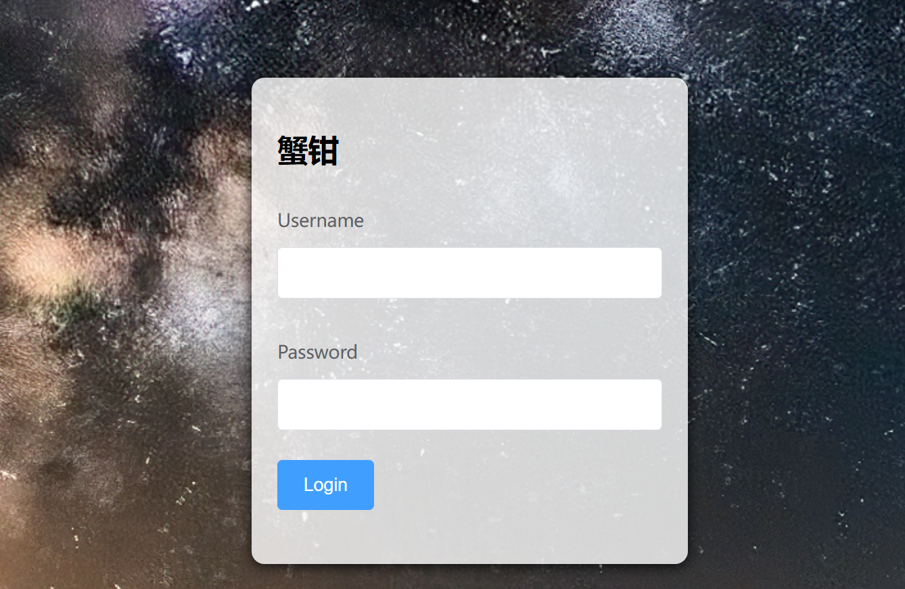
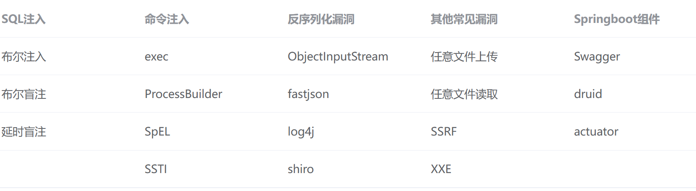

# java 蟹钳靶场


## 项目介绍

蟹钳靶场，一个后期使用springboot实现的一款综合型Java靶场，前端使用Vue实现用户交互UI。（我前端很菜，前端写的不好看）

使用JDK1.8 

数据库使用 mysql部署

修改配置后可实现前后端分离。

\CrabClaws\src\main\java\com\CrabClawsApplication\config\IPconfig.java

    public static String IP = "you IP";
    public static String URL = "http://" + IP + "/";

在vue.config.js部分 修改后端springboot端口

```
proxy: {
            '/api': {
                target: 'http://you IP : Path"',
                changeTarget: true,
                pathRewrite: {
                    '^/api': ''
                }
            }
        }
```

在application.yaml修改连接数据库的账号密码

```
    url: jdbc:mysql://localhost:3306/bachang?characterEncoding=utf-8&useSSL=false
    username: root
    password: 123456
```

初始账号密码  admin:admin（登录后可修改）




可以帮助安全行业的工作人员了解漏洞和学习代码审计。

## 实现的漏洞模块



